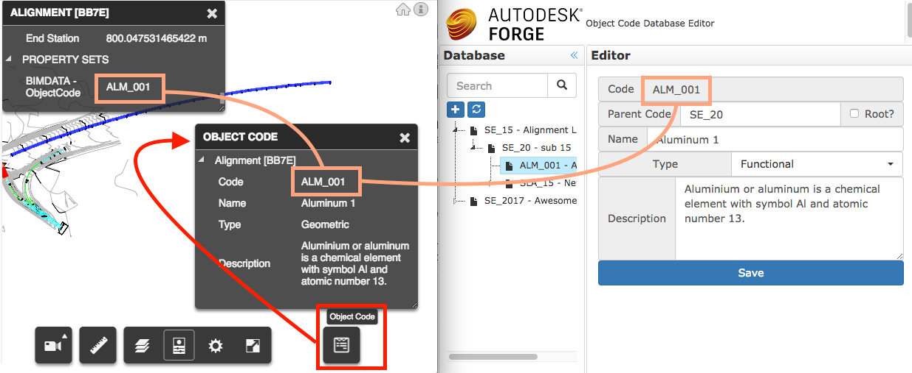
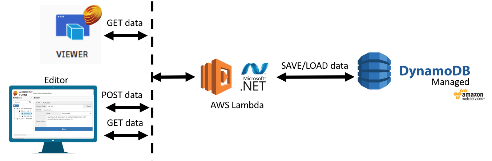
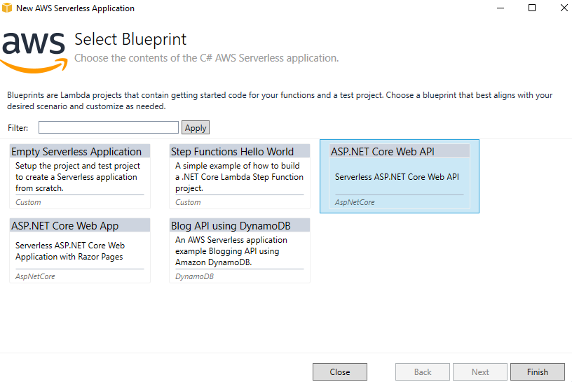

# custom.properties-csharp-lambda.dynamodb

This sample implements a no-sql database to store data linked by a **ObjectCode** property of elements on **Viewer**. 
# Overview

This sample contains 3 modules:

 - **lambda.dynamo**: server-side REST API written in C# .NET and hosted on AWS Lambda, using a Amazon DynamoDB No-SQL database to the data.
 - **static.database.editor**: jQuery static UI where user can navigate on a tree of hierarchical codes (jsTree) and view properties on the panel
 - **viewer.extension**: Viewer extension that shows a toolbar button and a docking panel toolbar.

The image below shows the **viewer.extension** loaded on Viewer (left side) and **static.database.editor** page editing the same ObjectCode.

## AWS Architecture

This sample uses **AWS Lambda** on-demand compute to react to incoming calls. It connects to **Amazon DynamoDB** to `Save` or `Load` the object code data. This is the **lambda.dynamo** module.

The **static.database.editor** module is a static collection of HTML/JS/CSS that can be hosted on any static content deliver, such as **Amazon Cloud Front**. 

### AWS Lambda

There are different options to create a .NET project for AWS Lambda. This sample uses the **ASP.NET Core Web API**, which is compatible with existing Web API apps, easier to migrate from existing apps. To create a new project, select the following blue print.

### Amazon DynamoDB

A table is required for this sample. The code creates it on demand, but make sure to allow the required permissions. Review the provisioned read & write capacity to adjust to your needs. 

The [DynamoDBContext](https://docs.aws.amazon.com/pt_br/amazondynamodb/latest/developerguide/DotNetDynamoDBContext.html) SDK class will take care of `Save` and `Load` documents into the Model.ObjectCode class. To edit what is saved, change the properties of this class.

### Amazon Cloud Front

The **static.database.editor** can be easily serveed via [Cloud Front](https://aws.amazon.com/cloudfront/). 

### Other services used:

 - **Amazon API Gateway**: Receive incomming requests and redirect to the Lambda function
 - **Amazon S3**: The .NET package is deployed and server from a bucket
 - **AWS CloudFormation**: The selected blueprint will define a **Stack** that can easily maintained.

# Setup

To use this sample, make sure to edit the **AWS Profile** and **Region** at [this file](blob/master/ObjectCode/ObjectCode/aws-lambda-tools-defaults.json).

The [AWS Toolkit for Visual Studio](https://aws.amazon.com/visualstudio/) is a must have tool for .NET developers. With that, the "*Publish to AWS Lambda*" toolkit feature will take care of compiling the code, uploading to S3 and triggering the CloudFormation. 

As of now, the **static.database.editor** needs manual deploy (via S3 bucket & Cloud Front). Just upload to a Amazon S3 bucket, allow public access to it. Then go to Cloud Front and create a new web distribution (all default settings, except set the Root file to **index.html**).

## License

This sample is licensed under the terms of the [MIT License](http://opensource.org/licenses/MIT). Please see the [LICENSE](LICENSE) file for full details.

## Author

Forge Partner Development Team

- Augusto Goncalves [@augustomaia](https://twitter.com/augustomaia)

See more at [Forge blog](https://forge.autodesk.com/blog).